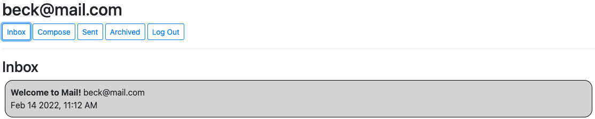
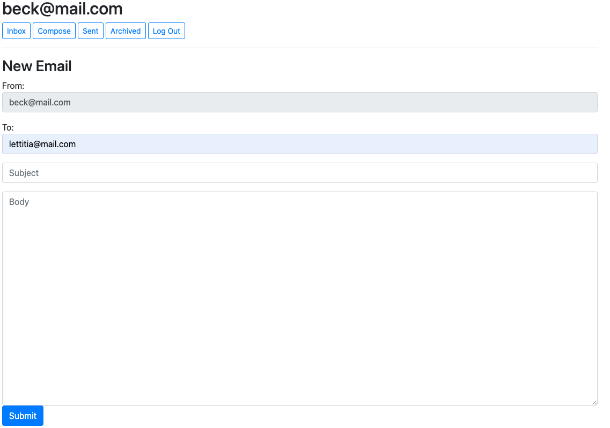
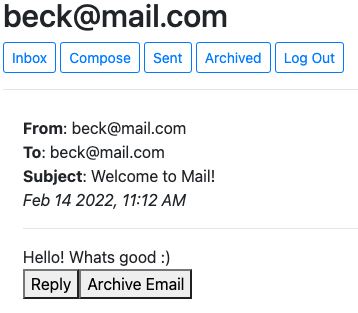

# Mail-System
Web Application that simulates an entire email system. made using Django, HTMl, CSS & Vanilla JavaScript

### Requirements 
    • Python 3.9  
    • Django

## Simple step-by-step tutorial
1. In terminal, run the app by typing 'python3 manage.py runserver'
2. Click on the local link generated in the terminal
3. Create an email account e.g. 'me@hello.com'
4. Send emails to anyone that has signed up!

## Features

1. Mailboxes
    • Inbox  
    • Sent
    • Archived
   
   

2. Composing new mail

3. Archiving & Replying

## Credits
CS50 team
